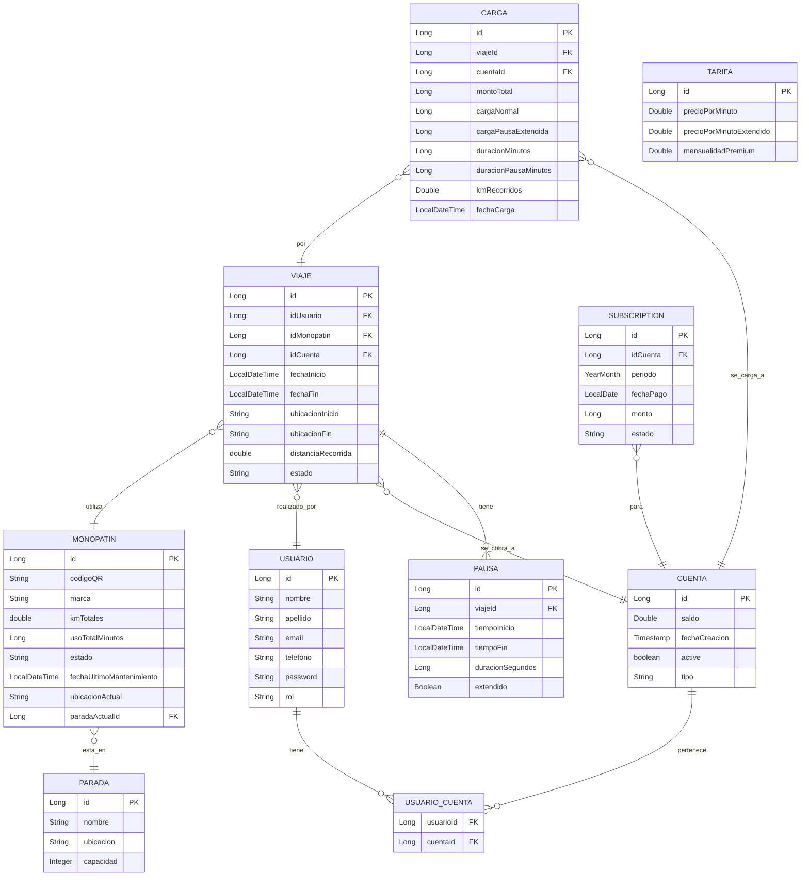

# Grupo 20 – Arquitectura Web 2025

## Despliegue - en tramite de que funcione, paciencia

### Despliegue de microservicios Gateway
#### Pasos necesarios
- **1 mvn clean package -DskipTests**  <---- **Crea los .jar necesarios para hacer andar toda la build de docker**
- **2 docker system prune -a --volumes** **(opcional o si tira error de containers duplicados en cache)**
- **3 docker-compose down -v** (opcional remueve la build si es necesario)
- **4 docker-compose up** **Levanta el servicio**
- #### Importar el archivo Tpe Arq Grupo20.postman_collection.json a postman, va a tirar error en {{BASE_PATH}} rellenar con http://localhost:8080 **Este archivo tiene los endpoints del gateway y de los servicios individuales**


# Sistema de Monopatines - Arquitectura de Microservicios


### Despliegue de microservicios individuales
**Microservicios actuales funcionando:**
- `mvc_usuario`
- `mvc_monopatin`
```
mvn -pl [nombre_microservicio] -am clean package -DskipTests
docker-compose up [nombre_microservicio]
```

**Ejemplo de uso**:
- Consola 1
```
mvn -pl mvc_usuario -am clean package -DskipTests
docker-compose up mvc_usuario
```

- Consola 2
```
mvn -pl mvc_monopatin -am clean package -DskipTests
docker-compose up mvc_monopatin
```

#### Datos de color.
¿Que hace exactamente esta cuestion `mvn -pl [nombre_microservicio] -am clean package -DskipTests`?
1. No tengo ni idea, pero genera un .jar que nos sirve para poder levantar el `Dockerfile`
2. HAce esto:
    - `mvn`: Ejecuta Maven, el gestor de dependencias y build system de Java. Cada ejecución se compone de fases (como `clean`, `compile`, `package`, `install`, etc.) y de plugins que definen cómo hacerlo (por ejemplo, `maven-compiler-plugin`, `spring-boot-maven-plugin`).
    - `-pl mvc_usuario`: Significa **Project List** → indica qué módulo(s) querés compilar dentro del multi-módulo.
        - El proyecto padre (`monopatines`) tiene varios módulos: `mvc_usuario`, `mvc_monopatin`, `mvc_facturacion`, etc.
        - Con `-pl mvc_usuario` le decís: - *Solo quiero construir este módulo (mvc_usuario) y sus dependencias internas*.💡 Sin `-pl`, Maven intentaría construir todos los módulos del pom padre.
    - `-am`: Significa `also make` (también construir dependencias).
        - Si `mvc_usuario` depende de otro módulo del mismo multi-módulo (por ejemplo `core`, `common`, `utils`, etc.), Maven también construirá esos automáticamente.
        - Puede no ser esencial (si `mvc_usuario` es independiente), pero es buena práctica incluirlo, por si más adelante agregás dependencias internas.
    - `clean`: Limpia la carpeta target/ del módulo y de sus dependencias (borra archivos generados en builds previos).