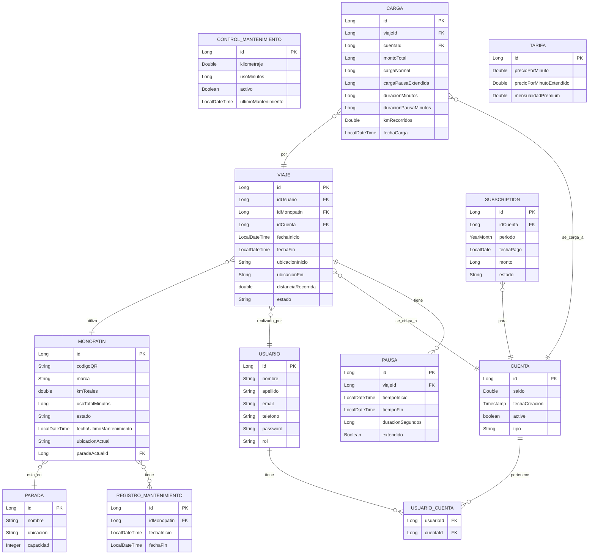

# Grupo 20 – Arquitectura Web 2025

## Despliegue - en tramite de que funcione, paciencia

### Despliegue de microservicios Gateway
#### Pasos necesarios
- **1 mvn clean package -DskipTests**  <---- **Crea los .jar necesarios para hacer andar toda la build de docker**
- **2 docker system prune -a --volumes** **(opcional o si tira error de containers duplicados en cache)**
- **3 docker-compose down -v** (opcional remueve la build si es necesario)
- **4 docker-compose up** **Levanta el servicio**
- #### Importar el archivo Tpe Arq Grupo20.postman_collection.json a postman, va a tirar error en {{BASE_PATH}} rellenar con http://localhost:8080 **Este archivo tiene los endpoints del gateway y de los servicios individuales**
- #### Tambien va a tirar error en Authorization elegi el Auth Type: Bearer Token y copia en {{TOKEN}} el token sacado de AuthenticateUser 

# Sistema de Monopatines - Arquitectura de Microservicios

