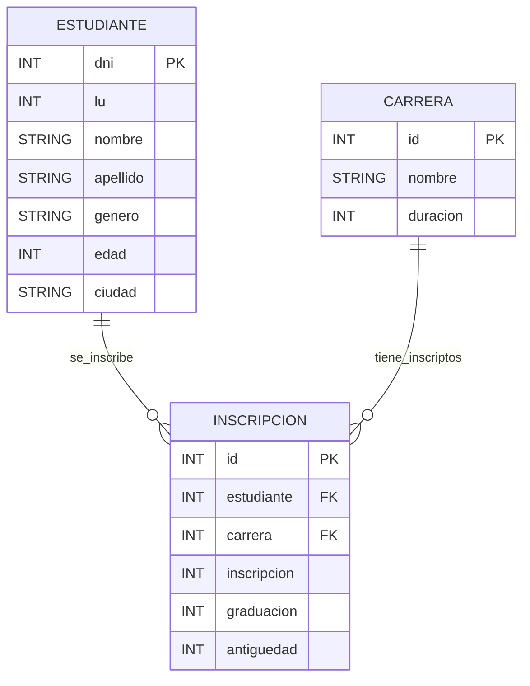

# TP Integrador - Documentacion

> 1) Considere el diseño de un registro de estudiantes, con la siguiente información: nombres, apellido,  edad,  género,  número  de  documento,  ciudad  de  residencia,  número  de  libreta universitaria, carrera(s) en la que está inscripto, antigüedad en cada una de esas carreras, y si se graduó o no. Diseñar el diagrama de objetos y el diagrama DER correspondiente.


## Esquema de Base de Datos



Notas
- Claves primarias: `ESTUDIANTE.dni`, `CARRERA.id`, `INSCRIPCION.id`.
- Foráneas: `INSCRIPCION.estudiante -> ESTUDIANTE.dni`, `INSCRIPCION.carrera -> CARRERA.id`.
- Restricción de unicidad: `(estudiante, carrera)` en `INSCRIPCION` para evitar duplicados.
- `lu` es único por estudiante.

## Codigo SQL nativo equivalente:
**2.a**
- Dar de alta un estudiante.
``` sql
INSERT INTO ESTUDIANTE (dni, lu, nombre, apellido, genero, edad, ciudad)
VALUES (?, ?, ?, ?, ?, ?, ?);
```
**2.b**
- Matricular a un estudiante en una carrera.
``` sql
INSERT INTO INSCRIPCION (estudiante, carrera, inscripcion, graduacion, antiguedad)
VALUES (?, ?, ?, ?, ?);
```
**2.c**
- Recuperar todos los estudiantes, y especificar algún criterio de ordenamiento simple.
``` sql
SELECT * FROM ESTUDIANTE
ORDER BY apellido ASC;
```
**2.d**
- Recuperar un estudiante por su número de libreta universitaria.
``` sql
SELECT * FROM ESTUDIANTE
WHERE lu = ?;
```
**2.e**
- Recuperar todos los estudiantes en base a su género.
``` sql
SELECT * FROM ESTUDIANTE
WHERE genero = ?;
```
**2.f**
- Recuperar las carrera con los estudianes inscriptos, ordenadas por la cantidad de inscriptos.
``` sql
SELECT C.id, C.nombre, COUNT(I.estudiante) AS cantidad_inscriptos
FROM CARRERA C
JOIN INSCRIPCION I ON C.id = I.carrera
GROUP BY C.id, C.nombre
ORDER BY cantidad_inscriptos DESC;
```
**2.g**
- Recuperar los estudiantes de una determinada carrera, filtrados por ciudad de residencia.
``` sql
SELECT E.dni, E.nombre, E.apellido, C.nombre AS carrera, E.ciudad
FROM ESTUDIANTE E
JOIN INSCRIPCION I ON E.dni = I.estudiante
JOIN CARRERA C ON I.carrera = C.id
WHERE C.nombre = ? AND E.ciudad = ?;
```

# 3. Generar  un  reporte  de  las  carreras,  que  para  cada  carrera  incluya  información  de  los inscriptos y egresados por año. Se deben ordenar las carreras alfabéticamente, y presentar los años de manera cronológica.
``` sql
SELECT C.nombre AS carrera, I.inscripcion, I.graduacion, COUNT(I.estudiante) AS cantidad_inscriptos
FROM CARRERA C
JOIN INSCRIPCION I ON C.id = I.carrera
GROUP BY C.nombre, I.inscripcion, I.graduacion
ORDER BY C.nombre ASC, I.inscripcion ASC;
```